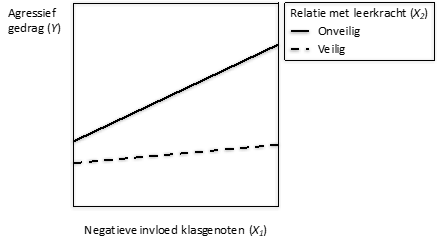

```{r, echo = FALSE, results = "hide"}
include_supplement("vufgb-moderation-005-nl.png", recursive = TRUE)
```

Question
========
What is the correct interpretation of the significant interaction effect shown in the figure below? 



Complete: "The ... relationship between Negative influence of classmates and Aggressive behavior of students in the classroom is ... when the relationship with the teacher is secure compared to when this relationship is unsafe."

Answerlist
----------
* Positive; Stronger.
* Positive; Weaker.
* Negative; Stronger.
* Negative; Weaker.

Meta-information
================
exname: vufgb-moderation-005-en
extype: schoice
exsolution: 0100
exsection:Inferential Statistics/Regression/Multiple linear regression/Moderation
exextra[ID]: e36da
exextra[Type]: Conceptual, Interpreting graphh
exextra[Language]: Dutch
exextra[Level]: Statistical Thinking
