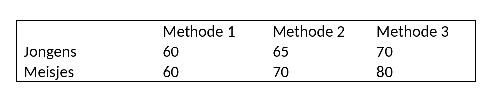

```{r, echo = FALSE, results = "hide"}
include_supplement("vufgb-moderation-006-nl-graph-01.png", recursive = TRUE)
```
Question
========
  
A two-way ANOVA shows that the interaction between gender and teaching method on reading ability is significant. The following averages are found. Which description of the interaction effect is correct? The differences in reading ability...

 
  
Answerlist
----------
* ... between boys and girls depend on the teaching method.
* ... between teaching methods are greater in boys than in girls.
* ... between teaching methods disappear when controlled for gender.
* ... between boys and girls become stronger when they follow the same teaching method.

Solution
========

Answerlist
----------
* Correct
* Incorrect
* Incorrect
* Incorrect

Meta-information
================
exname: vufgb-moderation-006-en
extype: schoice
exsolution: 1000
exsection: Inferential Statistics/Regression/Multiple linear regression/Moderation, Inferential Statistics/Parametric Techniques/ANOVA/Twoway ANOVA
exextra[ID]: 228b4
exextra[Type]: Conceptual
exextra[Language]: English
exextra[Level]: Statistical Reasoning
