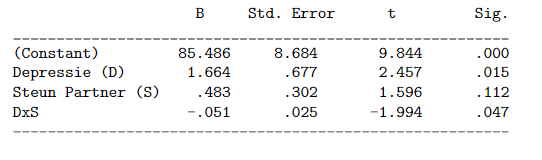

```{r, echo = FALSE, results = "hide"}
include_supplement("vufgb-moderation-007-nl-table01.jpg", recursive = TRUE)
```

Question
========

Given is the SPSS output of a regression model testing whether the effect of depressive symptoms on parenting stress in mothers depends on partner support (Depression and Support scores run from 0 to 20).

Which conclusion about the interaction effect is correct?

At higher values of partner support...


  
Answerlist
----------
* The effect of depression on stress disappears.
* The effect of depression on stress appears.
* The effect of depression on stress increases.
* The effect of depression on stress becomes smaller.

Solution
========

Answerlist
----------
* Incorrect
* Incorrect
* Incorrect
* Correct

Meta-information
================
exname: vufgb-moderation-007-en
extype: schoice
exsolution: 0001
exsection: Inferential Statistics/Regression/Multiple linear regression/Moderation, Inferential Statistics/Regression
exextra[Type]: Interpreting output
exextra[Program]: SPSS
exextra[Language]: English
exextra[Level]: Statistical Thinking
