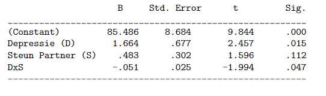

```{r, echo = FALSE, results = "hide"}
include_supplement("vufgb-moderation-007-nl-table01.jpg", recursive = TRUE)
```

Question
========

Gegeven is de SPSS output van een regressiemodel, waarmee getoetst wordt of het
effect van depressieve klachten op ouderschapsstress bij moeders afhangt van de steun van de partner (Depressie- en Steunscores lopen van 0 tot 20). 

Welke conclusie over het interactie-effect is juist? 

Bij hogere waarden van steun van de partner...


  
Answerlist
----------
* verdwijnt het effect van depressie op stress.
* komt het effect van depressie op stress tevoorschijn.
* wordt het effect van depressie op stress groter.
* wordt het effect van depressie op stress kleiner.

Solution
========

Answerlist
----------
* Incorrect
* Incorrect
* Incorrect
* Correct

Meta-information
================
exname: vufgb-moderation-007-nl
extype: schoice
exsolution: 0001
exsection: Inferential Statistics/Regression/Multiple linear regression/Moderation, Inferential Statistics/Regression
exextra[Type]: Interpreting output
exextra[Program]: SPSS
exextra[Language]: Dutch
exextra[Level]: Statistical Thinking