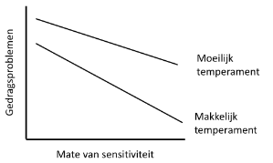

```{r, echo = FALSE, results = "hide"}
include_supplement("vufgb-moderation-014-nl-figure01.jpg", recursive = TRUE)
```

Question
========

The figure below shows the interaction effect between temperament of the child ($X_{2}$) and parental sensitivity ($X_{1}$) on child behavioral problems (*Y*).

Which interpretation of the interaction effect is correct?


  
Answerlist
----------
* The negative relationship between sensitivity and behavioral problems becomes weaker when there is a difficult temperament compared to an easy temperament.
* The negative relationship between sensitivity and behavioral problems becomes stronger when there is a difficult temperament compared to an easy temperament.
* The negative relationship between sensitivity and behavioral problems disappears when there is a difficult temperament compared to an easy temperament.
* The negative relationship between sensitivity and behavioral problems appears when there is a difficult temperament compared to an easy temperament.

Solution
========

Answerlist
----------
* Correct
* Incorrect
* Incorrect
* Incorrect

Meta-information
================
exname: vufgb-moderation-014-en
extype: schoice
exsolution: 1000
exsection: Inferential Statistics/Regression/Multiple linear regression/Moderation
exextra[Type]: Interpreting graph
exextra[Program]: 
exextra[Language]: English
exextra[Level]: Statistical Literacy
