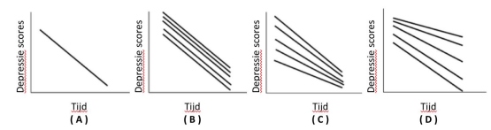

```{r, echo = FALSE, results = "hide"}
include_supplement("vufgb-multilevelanalysis-002-nl-figure01.jpg", recursive = TRUE)
```

Question
========

Research shows that there is a negative relationship between time and depression in a sample of adolescents with depression who all receive therapy. A linear mixed model with random intercept and random slope shows that adolescents differ in their degree of depression at the start of therapy but do not differ in the degree of the effect of therapy on them.

Which figure represents these findings? 


  
Answerlist
----------
* Figure ( A )
* Figure ( B )
* Figure ( C )
* Figure ( D )

Solution
========

Answerlist
----------
* Incorrect
* Correct
* Incorrect
* Incorrect

Meta-information
================
exname: vufgb-multilevelanalysis-002-en
extype: schoice
exsolution: 0100
exsection: Inferential Statistics/Multilevel Analysis, Inferential Statistics/Regression/Slope, Inferential Statistics/Regression/Intercept
exextra[ID]: 4926d
exextra[Type]: Interpreting graph
exextra[Program]: 
exextra[Language]: English
exextra[Level]: Statistical Literacy
