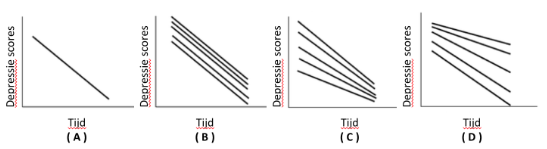

```{r, echo = FALSE, results = "hide"}
include_supplement("vufgb-multilevelanalysis-004-nl-figure01.jpg", recursive = TRUE)
```

Question
========

Research shows that there is a negative relationship between time and depression in a sample of fathers with depression who all receive therapy. A linear mixed model with random intercept and random slope shows that fathers who were more depressed at the start of therapy appear to benefit more from therapy.

Which figure represents these findings? 


  
Answerlist
----------
* Figure ( A )
* Figure ( B )
* Figure ( C )
* Figure ( D )

Solution
========

Answerlist
----------
* Incorrect
* Incorrect
* Correct
* Incorrect

Meta-information
================
exname: vufgb-multilevelanalysis-004-en
extype: schoice
exsolution: 0010
exsection: Inferential Statistics/Multilevel Analysis, Inferential Statistics/Regression/Intercept, Inferential Statistics/Regression/Slope
exextra[Type]: Interpreting graph
exextra[Program]: 
exextra[Language]: English
exextra[Level]: Statistical Literacy
