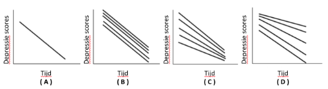

```{r, echo = FALSE, results = "hide"}
include_supplement("vufgb-multilevelanalysis-004-nl-figure01.jpg", recursive = TRUE)
```

Question
========

Uit onderzoek blijkt dat er een negatief verband is tussen tijd en depressie in een steekproef van vaders met depressie die allen therapie krijgen. Een linear mixed model met random intercept en random slope laat zien dat vaders die bij aanvang van de therapie depressiever waren meer baat lijken te hebben bij de therapie. 

Welke figuur geeft deze bevindingen weer? 


  
Answerlist
----------
* Figuur ( A )
* Figuur ( B )
* Figuur ( C )
* Figuur ( D )

Solution
========

Answerlist
----------
* Incorrect
* Incorrect
* Correct
* Incorrect

Meta-information
================
exname: vufgb-multilevelanalysis-004-nl
extype: schoice
exsolution: 0010
exsection: Inferential Statistics/Multilevel Analysis, Inferential Statistics/Regression/Intercept, Inferential Statistics/Regression/Slope
exextra[Type]: Interpreting graph
exextra[Program]: 
exextra[Language]: Dutch
exextra[Level]: Statistical Literacy