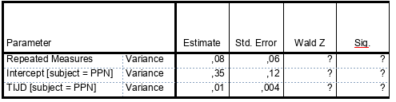

```{r, echo = FALSE, results = "hide"}
include_supplement("vufgb-multilevelanalysis-005-nl-table01.jpg", recursive = TRUE)
```

Question
========

A linear mixed model analysis in SPSS gives the following results for the random effects. Perform the Wald test to test whether the random slope is significant.


  
Answerlist
----------
* Wald $Z = 1.33$, $p < .05$ so significant.
* Wald $Z = 2.50$, $p < .05$ so significant.
* Wald $Z = 1.33$, $p > .05$ so not significant.
* Wald $Z = 2.50$, $p > .05$ so not significant.

Solution
========

Answerlist
----------
* Incorrect
* Correct
* Incorrect
* Incorrect

Meta-information
================
exname: vufgb-multilevelanalysis-005-en
extype: schoice
exsolution: 0100
exsection: Inferential Statistics/Multilevel Analysis, Inferential Statistics/Regression/Slope
exextra[Type]: Performing analysis
exextra[Program]: SPSS
exextra[Language]: English
exextra[Level]: Statistical Thinking
