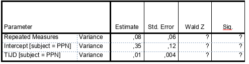

```{r, echo = FALSE, results = "hide"}
include_supplement("vufgb-multilevelanalysis-005-nl-table01.jpg", recursive = TRUE)
```

Question
========

Een linear mixed model analyse in SPSS geeft de volgende uitkomsten voor de random effecten. Voer de Wald-toets uit om de toetsen of de random slope significant is.


  
Answerlist
----------
* Wald $Z = 1.33$, $p < .05$ dus significant.
* Wald $Z = 2.50$, $p < .05$ dus significant.
* Wald $Z = 1.33$, $p > .05$ dus niet significant.
* Wald $Z = 2.50$, $p > .05$ dus niet significant.

Solution
========

Answerlist
----------
* Incorrect
* Correct
* Incorrect
* Incorrect

Meta-information
================
exname: vufgb-multilevelanalysis-005-nl
extype: schoice
exsolution: 0100
exsection: Inferential Statistics/Multilevel Analysis, Inferential Statistics/Regression/Slope
exextra[Type]: Performing analysis
exextra[Program]: SPSS
exextra[Language]: Dutch
exextra[Level]: Statistical Thinking