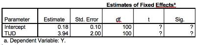

```{r, echo = FALSE, results = "hide"}
include_supplement("vufgb-multilevelanalysis-008-nl-table01.jpg", recursive = TRUE)
```

Question
========

The parameter estimates below are found for the fixed effects in a linear mixed model.

Perform the *t* test for the fixed effect of Time.


  
Answerlist
----------
* $t(df = 100) = 1.80,\;p > 0.05$.
* $t(df = 100) = 1.80,\;p < 0.05$.
* $t(df = 100) = 1.97,\;p > 0.05$.
* $t(df = 100) = 1.97,\;p < 0.05$.

Solution
========

Answerlist
----------
* Incorrect
* Incorrect
* Correct
* Incorrect

Meta-information
================
exname: vufgb-multilevelanalysis-008-en
extype: schoice
exsolution: 0010
exsection: Inferential Statistics/Multilevel Analysis
exextra[Type]: Performing analysis
exextra[Program]: 
exextra[Language]: English
exextra[Level]: Statistical Thinking
