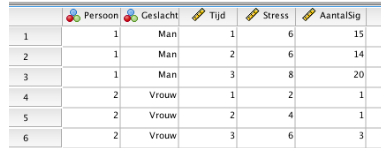

```{r, echo = FALSE, results = "hide"}
include_supplement("vufgb-multilevelanalysis-009-nl-figure01.jpg", recursive = TRUE)
```

Question
========

An SPSS dataset for the first two subjects is shown below. A linear mixed model for repeated measures is run with Time, Gender and Stress as predictors and Number of cigarettes per day (NumberSig) as the outcome measure.

Supplement.

The dataset is in ... format and Stress is a ... .


  
Answerlist
----------
* Wide' ; Time-varying covariate
* Wide' ; Between-subject factor
* Long' ; Time-varying covariate
* Long' ; Between-subject factor

Solution
========

Answerlist
----------
* Incorrect
* Incorrect
* Correct
* Incorrect

Meta-information
================
exname: vufgb-multilevelanalysis-009-en
extype: schoice
exsolution: 0010
exsection: Inferential Statistics/Multilevel Analysis
exextra[ID]: 30ad8
exextra[Type]: Interpreting graph
exextra[Program]: SPSS
exextra[Language]: English
exextra[Level]: Statistical Literacy
