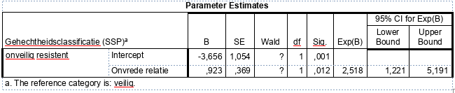

```{r, echo = FALSE, results = "hide"}
include_supplement("vufgb-multinomiallogisticregression-009-nl-table01.jpg", recursive = TRUE)
```

Question
========

Given is part of an SPSS table with results of a multinomial logistic regression analysis.

Calculate the Wald value associated with the test of whether there is a relationship between dissatisfaction in the partner relationship and the likelihood of an insecure resistant attachment. 


  
Answerlist
----------
* 2.50
* 3.47
* 6.26
* 12.03

Solution
========

Answerlist
----------
* Incorrect
* Incorrect
* Correct
* Incorrect

Meta-information
================
exname: vufgb-multinomiallogisticregression-009-en
extype: schoice
exsolution: 0010
exsection: Inferential Statistics/Regression/Multinomial logistic regression
exextra[Type]: Calculation, Interpreting output
exextra[Program]: SPSS
exextra[Language]: English
exextra[Level]: Statistical Literacy
