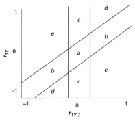

```{r, echo = FALSE, results = "hide"}
include_supplement("vufgb-multiplelinearregression-003-nl.png", recursive = TRUE)
```

Question
========
In onderstaande figuur staat de zero-order correlatie tussen $y$ en $x_1$ op de y-as en de partiele correlatie tussen $y$ en $x_1$ gecontroleerd voor $x_2$ op de x-as. 



Van welk type multivariate relatie is sprake als het patroon van correlaties zich in de vlakken *b* bevindt?

Answerlist
----------
* $x_2$ is irrelevant.
* Suppressor effect.
* Partiele confounding of mediatie.
* Volledige confounding of mediatie.

Meta-information
================
exname: vufgb-multiplelinearregression-003-nl
extype: schoice
exsolution: 1000
exsection: Inferential Statistics/Regression/Multiple linear regression
exextra[ID]: 83d64
exextra[Type]: Case, Interpreting graph
exextra[Language]: Dutch
exextra[Level]: Statistical Thinking
