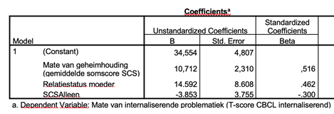

```{r, echo = FALSE, results = "hide"}
include_supplement("vufgb-multiplelinearregression-004-nl.png", recursive = TRUE)
```

Question
========
Zie de volgende resultaten van een regressiemodel met interactie. De steekproef bestond uit 101 personen.



Stel een 95% betrouwbaarheidsinterval op om te bepalen of de interactie tussen geheimhouding en relatiestatus ("SCS*Alleen") significant is.

Answerlist
----------
* *t*(*df* = 98) = -1.03, *p* > .05; interactie is niet significant.
* *t*(*df* = 97) = -1.03, *p* > .05; interactie is niet significant.
* *t*(*df* = 98) = 1.70, *p* > .05; interactie is niet significant.
* *t*(*df* = 97) = 1.70, *p* > .05; interactie is niet significant.

Meta-information
================
exname: vufgb-multiplelinearregression-004-nl
extype: schoice
exsolution: 0100
exsection: Inferential Statistics/Regression/Multiple linear regression
exextra[Type]: Calculation, Case, Interpreting output
exextra[Language]: Dutch
exextra[Level]: Statistical Thinking