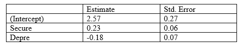

```{r, echo = FALSE, results = "hide"}
include_supplement("vufgb-multiplelinearregression-009-en-table01.jpg", recursive = TRUE)
```

Question
========

A student investigates the relationship between secure attachment representation of mothers (Secure), their depressive complaints (depr) and the confidence in their own role as a mother (effic). 

The student has a sample of 30 mothers, and ran a multiple regression on this sample. A part of the results is in the table underneath. Carry out a two-sided test for the regression coefficient of the attachment representation of mothers (Secure), and draw a conclusion.



  
Answerlist
----------
* $t = 3.83, \; df = 28, \; p < .002$; de regression coefficient deviates significantly from 0  
* $t = 3.83, \; df = 27, \; p < .002$; de regression coefficient deviates significantly from 0
* $t = 3.83, \; df = 28, \; .002 < p < .05$; de regression coefficient deviates significantly from 0
* $t = 3.83, \; df = 27, \; .002 < p < .05$; de regression coefficient deviates significantly from 0 

Solution
========

Determine the *t*-value of the corresponding *df*. The $t = \frac{bi}{se} = \frac{0.23}{0.06} = 3.83$. The $df = n-(k+1) = 30-(2+1) = 27$. Look in the *t*-table at the critical *t*-value that corresponds with the right-sided exceedance probability of 0.025. Critical $t = 2.025$. De found *t* is bigger than the critical *t* so we reject the nul hypothesis ($b = 0$). The found *t* is smaller than $t = 3.421$, which corresponds with the right-sided exceedance probability of .001 (the *p*-value of .002). So, the *p*-value belonging to the found $t = 3.83$ is smaller than .002.

Answerlist
----------
* Incorrect
* Correct
* Incorrect
* Incorrect

Meta-information
================
exname: vufgb-multiplelinearregression-009-en
extype: schoice
exsolution: 0100
exsection: Inferential Statistics/Regression/Multiple linear regression
exextra[Type]: Performing analysis
exextra[Program]: 
exextra[Language]: English
exextra[Level]: Statistical Reasoning