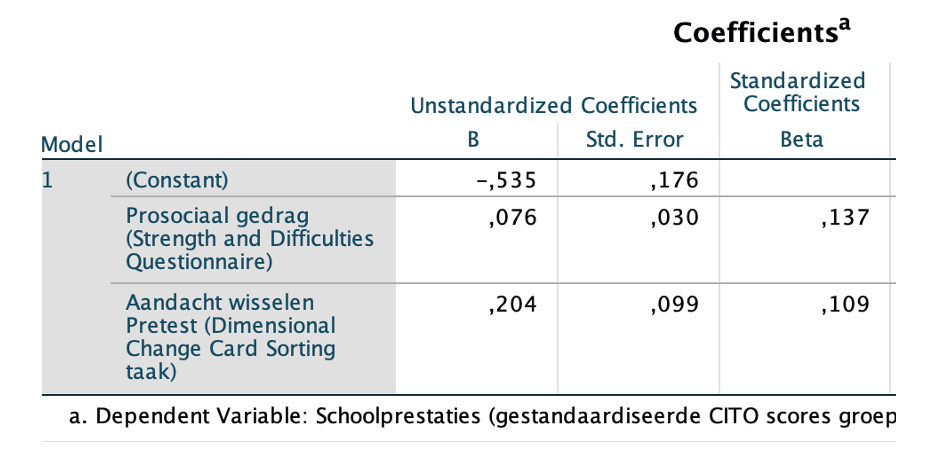

```{r, echo = FALSE, results = "hide"}
include_supplement("vufgb-multiplelinearregression-010-nl-graph-01.png", recursive = TRUE)
```
Question
========
  
Review the SPSS results below. A multiple regression was conducted on the effects of prosocial behavior and the ability to switch attention on the school performance of 350 students. School performance was measured using a standardized CITO test with a mean score of 0 and a standard deviation of 1. 

 

What can you expect for school performance for a student who scores 8 on the prosocial behavior questionnaire and 0.75 on the task measuring attention switching? The expected school performance score is _____ . 
Answerlist
----------
* 0.23.
* 1.15.
* 1.18.
* 1.30.

Solution
========

Answerlist
----------
* Correct
* Incorrect
* Incorrect
* Incorrect

Meta-information
================
exname: vufgb-multiplelinearregression-010-en
extype: schoice
exsolution: 1000
exsection: Inferential Statistics/Regression/Multiple linear regression
exextra[ID]: 3129d
exextra[Type]: Calculation, Case
exextra[Language]: English
exextra[Level]: Statistical Thinking
