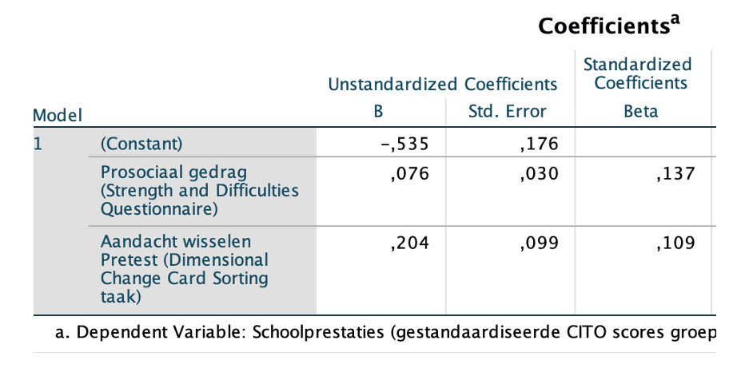

```{r, echo = FALSE, results = "hide"}
include_supplement("vufgb-multiplelinearregression-010-nl-graph-01.png", recursive = TRUE)
```
Question
========
  
Bekijk onderstaande SPSS uitkomsten. Er is een meervoudige regressie uitgevoerd naar de effecten van prosociaal gedrag en het kunnen wisselen van aandacht op de schoolprestaties van 350 leerlingen. De schoolprestaties zijn gemeten aan de hand van een gestandaardiseerde CITO test met een gemiddelde score van 0 en een standaarddeviatie van 1. 

 

Wat kun je verwachten van de schoolprestaties voor een leerling die 8 scoort op de vragenlijst voor prosociaal gedrag en 0.75 op de taak die het wisselen van aandacht meet? De verwachte score voor schoolprestaties is _____ .
  
Answerlist
----------
* 0.23. 
* 1.15.
* 1.18.
* 1.30.

Solution
========

Answerlist
----------
* Correct
* Incorrect
* Incorrect
* Incorrect

Meta-information
================
exname: vufgb-multiplelinearregression-010-nl
extype: schoice
exsolution: 1000
exsection: Inferential Statistics/Regression/Multiple linear regression
exextra[Type]: Calculation, Case
exextra[Language]: Dutch
exextra[Level]: Statistical Thinking