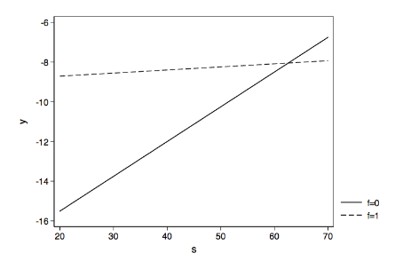

```{r, echo = FALSE, results = "hide"}
include_supplement("vufgb-multiplelinearregression-026-nl-graph01.jpg", recursive = TRUE)
```

Question
========

Given is the figure below with two estimated regression lines belonging to a multiple regression model with interaction term between two predictors s and f.

Complete.

The regression coefficient of s is ... and the regression coefficient of the interaction term s*f is ... .



  
Answerlist
----------
* Positive; positive
* Negative; negative
* Positive; negative
* Negative; positive


Solution
========

Answerlist
----------
* Incorrect
* Incorrect
* Correct
* Incorrect

Meta-information
================
exname: vufgb-multiplelinearregression-026-en
extype: schoice
exsolution: 0010
exsection: Statistics/Regression/Multiple linear regression, Inferential Statistics/RegressionInferential, Descriptive statistics/Data representation/Graphs
exextra[Type]: Interpreting graph, Conceptual
exextra[Program]: 
exextra[Language]: English
exextra[Level]: Statistical Literacy
