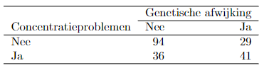

```{r, echo = FALSE, results = "hide"}
include_supplement("vufgb-multiplelinearregression-027-nl-table01.jpg", recursive = TRUE)
```

Question
========

A PhD student in Biological Psychology is investigating whether a certain genetic abnormality is associated with concentration problems. The sample of 200 individuals is distributed as follows.


  
There appears to be a significant relationship between the genetic abnormality and concentration problems, $\chi^{2}(1) = 17.04$,$p < .001$.  

Splitting the data by men and women shows that in men there does appear to be an association between the genetic defect and concentration problems, $$chi^{2}(1) = 24.40, $p < .001$, but not in women, $\chi^{2}(1) = 0.63$, $p = .43$. What type of relationship between genetic defect, concentration problems and gender is involved here? 
Answerlist
----------
* An improper relationship between genetic abnormality and concentration problems.
* A concatenation of relationships with gender as mediator.
* An interaction with gender as moderator.
* A direct and indirect effect of concentration problems.

Solution
========

Answerlist
----------
* Incorrect
* Incorrect
* Correct
* Incorrect

Meta-information
================
exname: vufgb-multiplelinearregression-027-en
extype: schoice
exsolution: 0010
exsection: Inferential Statistics/Regression/Multiple linear regression, Inferential Statistics/Regression/Multiple linear regression/Moderation
exextra[Type]: Interpreting output
exextra[Program]: 
exextra[Language]: English
exextra[Level]: Statistical Literacy
