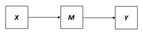

```{r, echo = FALSE, results = "hide"}
include_supplement("vufgb-multiplelinearregression-028-nl-figure01.jpg", recursive = TRUE)
```

Question
========

The figure below shows a chain relationship between the variables *X*, *M* and *Y*. What is *M* also called?


  
Answerlist
----------
* Moderator variable
* Intervening variable
* Suppressor variable
* Confounder

Solution
========

Answerlist
----------
* Incorrect
* Correct
* Incorrect
* Incorrect

Meta-information
================
exname: vufgb-multiplelinearregression-028-en
extype: schoice
exsolution: 0100
exsection: Inferential Statistics/Regression/Multiple linear regression
exextra[ID]: 52c9f
exextra[Type]: Conceptual
exextra[Program]: 
exextra[Language]: English
exextra[Level]: Statistical Literacy
