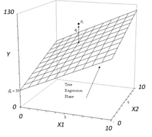

```{r, echo = FALSE, results = "hide"}
include_supplement("vufgb-multiplelinearregression-029-nl-figure01.jpg", recursive = TRUE)
```

Question
========

The figure below shows a regression plane belonging to a multiple regression model with two predictors.

Complete.

The partial relationship between *y* and $x_{1}$ is ..., and the partial relationship between *y* and $x_{2}$ is ... .


  
Answerlist
----------
* Positive; positive
* Negative; negative
* Positive; negative
* Negative; positive

Solution
========

Answerlist
----------
* Correct
* Incorrect
* Incorrect
* Incorrect

Meta-information
================
exname: vufgb-multiplelinearregression-029-en
extype: schoice
exsolution: 1000
exsection: Inferential Statistics/Regression/Multiple linear regression, Descriptive statistics/Data representation/Graphs/Scatterplot
exextra[Type]: Interpreting graph
exextra[Program]: 
exextra[Language]: English
exextra[Level]: Statistical Literacy
