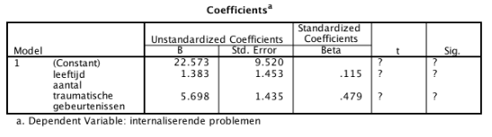

```{r, echo = FALSE, results = "hide"}
include_supplement("vufgb-multiplelinearregression-036-nl-table01.jpg", recursive = TRUE)
```

Question
========

In a sample of 50 children from youth services, we examine whether there is an association between the number of traumatic events experienced and internalizing behavior problems. Age is controlled for in the multiple regression analysis.

Using the data in the SPSS table below, test whether the above relationship is significant.


  
Answerlist
----------
* $t = 3.97,\;df = 47,\;p < .001$
* $t = 3.97,\;df = 48,\;p < .001$
* $t = 0.95,\;df = 47,\;p > .05$
* $t = 0.95,\;df = 48,\;p > .05$

Solution
========

Answerlist
----------
* Correct
* Incorrect
* Incorrect
* Incorrect

Meta-information
================
exname: vufgb-multiplelinearregression-036-en
extype: schoice
exsolution: 1000
exsection: Inferential Statistics/Regression/Multiple linear regression
exextra[ID]: c466b
exextra[Type]: Performing analysis, Interpreting output
exextra[Program]: SPSS
exextra[Language]: English
exextra[Level]: Statistical Thinking
