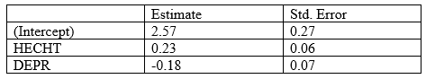

```{r, echo = FALSE, results = "hide"}
include_supplement("vufgb-multiplelinearregression-038-nl-table01.jpg", recursive = TRUE)
```

Question
========

A student, for her b-thesis, examines the relationship between secure attachment representation of mothers (HECHT), their depressive symptoms (DEPR) and confidence in their own role as mothers (EFFIC). She has a sample of 30 mothers, and conducted a multiple regression on this dataset. Some of the results are shown in the table below.

Construct a two-sided test for the regression coefficient of attachment representation of mothers (HECHT), and draw a conclusion.


  
Answerlist
----------
* $t = 3.83, \; df = 28, \; p<.002$ ; the regression coefficient deviates significantly from 0
* $t = 3.83, \; df = 27, \; p<.002$ ; the regression coefficient deviates significantly from 0
* $t = 3.83, \; df = 28, \; .002<p<.05$ ; the regression coefficient deviates significantly from 0
* $t = 3.83, \; df = 27, \; .002<p<.05$ ; the regression coefficient deviates significantly from 0

Solution
========

Determine the *t* value and associated df. The $t = \frac{b_{i}}{se} = \frac{0.23}{0.06} = 3.83$. The $df = n-(k+1) = 30-(2+1) = 27$.

Look in the *t* table for the critical *t* value associated with a right-hand overshoot probability of 0.025. Critical $t = 2.025$. The gevonden *t* is groter dan de kritieke *t* dus sowieso verwerpen we de nulhypothese dat $b = 0$. Found *t* is smaller than $t = 3.421$ die hoort bij rechteroverschrijdingskans van .001, dus *p*-waarde van .002. The *p*-waarde die hoort bij de gevonden $t = 3.83$ is thus smaller than .002.

Answerlist
----------
* Incorrect
* Correct
* Incorrect
* Incorrect

Meta-information
================
exname: vufgb-multiplelinearregression-038-en
extype: schoice
exsolution: 0100
exsection: Inferential Statistics/Regression/Multiple linear regression
exextra[ID]: f10bb
exextra[Type]: Performing analysis
exextra[Program]: 
exextra[Language]: English
exextra[Level]: Statistical Reasoning
