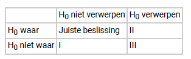

```{r, echo = FALSE, results = "hide"}
include_supplement("vufgb-nhst-001-nl-table01.jpg", recursive = TRUE)
```

Question
========
  
Vul in de tabel hieronder de juiste termen in bij I, II en III:




  
Answerlist
----------
* I: Type-I fout, II: Type-II fout, III: Power
* I: Type-II fout, II: Type-I fout, III: Power
* I: Type-II fout, II: Power, III: Type-I fout
* I: Type-I fout, II: Power, III: Type-II fout

Solution
========

Answerlist
----------
* Incorrect
* Correct
* Incorrect
* Incorrect

Meta-information
================
exname: vufgb-nhst-001-nl
extype: schoice
exsolution: 0100
exsection: Inferential Statistics/NHST/Hypothesis/Null hypothesis, Inferential Statistics/NHST/Statistical errors/Type I error, Inferential Statistics/NHST/Statistical errors/Type II error, Inferential Statistics/NHST/Power
exextra[Type]: Conceptual
exextra[Program]: 
exextra[Language]: Dutch
exextra[Level]: Statistical Literacy
