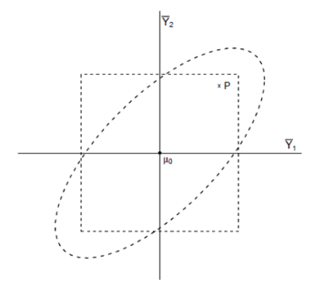

```{r, echo = FALSE, results = "hide"}
include_supplement("vufgb-nullhypothesis-003-en-figure01.jpg", recursive = TRUE)
```

Question
========

The image below visualizes the univariate and multivariate rejection areas for two outcomes $Y_{1}$ and $Y_{2}$ if for at least one outcome measure the null hypothesis is rejected. Imagine that in a particular sample the combination of results indicated by point P is observed. What is then the conclusion with univariate testing and what with multivariate testing?


  
Answerlist
----------
* Univariate: reject $H_{0}$; multivariate: reject $H_{0}$.
* Univariate: reject $H_{0}$; multivariate: do not reject $H_{0}$.
* Univariate: do not reject $H_{0}$; multivariate: reject $H_{0}$.
* Univariate: do not reject $H_{0}$; multivariate: do not reject $H_{0}$.

Solution
========

Answerlist
----------
* Incorrect
* Incorrect
* Incorrect
* Correct

Meta-information
================
exname: vufgb-nullhypothesis-003-en
extype: schoice
exsolution: 0001
exsection: Inferential Statistics/NHST/Hypothesis/Null hypothesis
exextra[Type]: Interpreting graph, Conceptual
exextra[Program]: 
exextra[Language]: English
exextra[Level]: Statistical Literacy