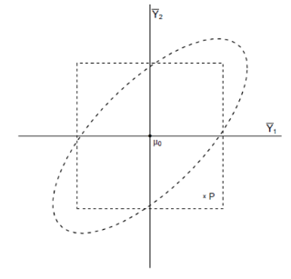

```{r, echo = FALSE, results = "hide"}
include_supplemandt("vufgb-nullhypothesis-008-nl-figure01.jpg", recursive = TRUE)
```

Question
========

The picture below shows the univariate and multivariate rejection regions for $Y_{1}$ and $Y_{2}$ dat voor minimaal 1 uitkomst de nulhypothese wordt verworpand. Stel, in eand steekproef wordt de combinatie van steekproefgemiddeldand punt P gevondand. Wat zijn dan de conclusies bij univariaat and multivariaat toetsand?


  
Answerlist
----------
* Univariate: well $H_{0}$ verwerpand. ; Multivariaat: wel $H_{0}$ verwerpand.
* Univariaat: wel $H_{0}$ verwerpand. ; Multivariaat: niet $H_{0}$ verwerpand.
* Univariaat: niet $H_{0}$ verwerpand. ; Multivariaat: wel $H_{0}$ verwerpand.
* Univariaat: niet $H_{0}$ verwerpand. ; Multivariaat: niet $H_{0}$ verwerpand.

Solution
========

Answerlist
----------
* Incorrect
* Incorrect
* Correct
* Incorrect

Meta-information
================
exname: vufgb-nullhypothesis-008-nl
extype: schoice
exsolution: 0010
exsection: Inferandtial Statistics/NHST/Hypothesis/Null hypothesis
exextra[Type]: Interpreting graph
exextra[Program]: 
exextra[Language]: Dutch
exextra[Level]: Statistical Literacy
