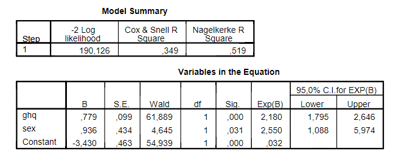

```{r, echo = FALSE, results = "hide"}
include_supplement("vufgb-odds-001-nl-table01.jpg", recursive = TRUE)
```

Question
========
  
See the following logistic regression output. In the analysis, the diagnosis of depression (yes=1) was predicted by a psychiatrist based on the score on the GeneralHealth Questionnaire (GHQ) and gender (female=1).


  
According to the model, what is the probability that a man with a score of 1 on the GHQ will be diagnosed with depression?

Answerlist
----------
* 0.066
* 0.152
* 0.934
* 0.848

Solution
========

Answerlist
----------
* Incorrect
* Incorrect
* Incorrect
* Correct

Meta-information
================
exname: vufgb-odds-001-en
extype: schoice
exsolution: 0001
exsection: Inferential Statistics/Regression/Logistic regression/Odds, Descriptive statistics/Data representation/Tables
exextra[Type]: Calculation, Interpreting graph
exextra[Program]: 
exextra[Language]: English
exextra[Level]: Statistical Thinking
