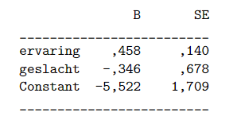

```{r, echo = FALSE, results = "hide"}
include_supplement("vufgb-odds-002-nl-table01.jpg", recursive = TRUE)
```

Question
========

See the logistic regression results below. In one study (n = 50), programmers must solve a programming problem in one hour. The resulting data file contains the response variable "solved" (dummy, solved within an hour=1) and the predictors "experience" (programming experience in months) and gender (dummy, male=1).


  
How many times does the odds increase if a programmer has two months more experience?  
  
Answerlist
----------
* 1.58
* 2.50
* 0.46
* 0.40

Solution
========

Answerlist
----------
* Incorrect
* Correct
* Incorrect
* Incorrect

Meta-information
================
exname: vufgb-odds-002-en
extype: schoice
exsolution: 0100
exsection: Inferential Statistics/Regression/Logistic regression/Odds
exextra[Type]: Calculation
exextra[Program]: 
exextra[Language]: English
exextra[Level]: Statistical Thinking
