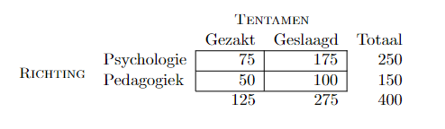

```{r, echo = FALSE, results = "hide"}
include_supplement("vufgb-odds-003-nl-table01.jpg", recursive = TRUE)
```

Question
========

Given is the cross table below. Complete.

The odds of passing for psychology students is ... . These odds are ... than the odds for pedagogy students.


  
Answerlist
----------
* 0.70, greater
* 0.70, smaller
* 2.33, smaller
* 2.33, greater

Solution
========

Answerlist
----------
* Incorrect
* Incorrect
* Incorrect
* Correct

Meta-information
================
exname: vufgb-odds-003-en
extype: schoice
exsolution: 0001
exsection: Inferential Statistics/Regression/Logistic regression/Odds
exextra[ID]: d0047
exextra[Type]: Calculation, Interpreting graph
exextra[Program]: 
exextra[Language]: English
exextra[Level]: Statistical Thinking
