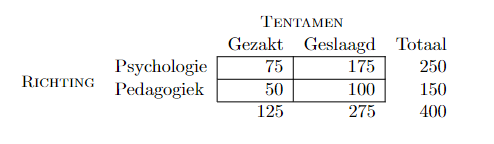

```{r, echo = FALSE, results = "hide"}
include_supplement("vufgb-odds-003-nl-table01.jpg", recursive = TRUE)
```

Question
========

Gegeven is onderstaande kruistabel. Vul aan. 

De odds om te slagen voor psychologie- studenten is ... . Deze odds is ... dan de odds voor pedagogiekstudenten.


  
Answerlist
----------
* 0.70, groter
* 0.70, kleiner
* 2.33, kleiner
* 2.33, groter

Solution
========

Answerlist
----------
* Incorrect
* Incorrect
* Incorrect
* Correct

Meta-information
================
exname: vufgb-odds-003-nl
extype: schoice
exsolution: 0001
exsection: Inferential Statistics/Regression/Logistic regression/Odds
exextra[Type]: Calculation, Interpreting graph
exextra[Program]: 
exextra[Language]: Dutch
exextra[Level]: Statistical Thinking