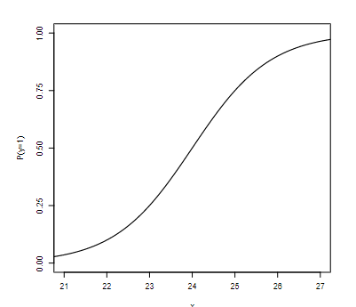

```{r, echo = FALSE, results = "hide"}
include_supplement("vufgb-odds-004-nl-graph01.jpg", recursive = TRUE)
```

Question
========

Based on a logistic regression, the figure below shows the relationship between scores on a dyslexia test (x) and the probability that a person actually has dyslexia (P(y = 1)).


  
What test score corresponds to an odds of 3 that someone has dyslexia?  
  
Answerlist
----------
* 23
* 24
* 25
* 27

Solution
========

Answerlist
----------
* Incorrect
* Incorrect
* Correct
* Incorrect

Meta-information
================
exname: vufgb-odds-004-en
extype: schoice
exsolution: 0010
exsection: Inferential Statistics/Regression/Logistic regression/Odds, Descriptive statistics/Data representation/Graphs
exextra[Type]: Calculation, Interpreting graph
exextra[Program]: 
exextra[Language]: English
exextra[Level]: Statistical Literacy
