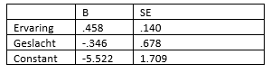

```{r, echo = FALSE, results = "hide"}
include_supplement("vufgb-odds-005-nl-table01.jpg", recursive = TRUE)
```

Question
========

See logistic regression results below. In a survey (n=150), programmers must solve a programming problem in one hour. The resulting data file contains the response variable "solved" (dummy, solved within an hour=1) and the predictors "experience" (programming experience in months) and gender (dummy, male=1).


  
At how many months of experience is the probability of a male programmer solving the problem 0.50? 
Answerlist
----------
* 12.0
* 12.8
* 11.6
* 10.9

Solution
========

Answerlist
----------
* Incorrect
* Correct
* Incorrect
* Incorrect

Meta-information
================
exname: vufgb-odds-005-en
extype: schoice
exsolution: 0100
exsection: Inferential Statistics/Regression/Logistic regression/Odds
exextra[ID]: 491d1
exextra[Type]: Interpreting output, Calculation
exextra[Program]: 
exextra[Language]: English
exextra[Level]: Statistical Thinking
