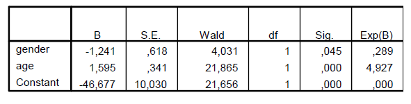

```{r, echo = FALSE, results = "hide"}
include_supplement("vufgb-odds-008-nl-table01.jpg", recursive = TRUE)
```

Question
========

The following logistic regression output applies to the following two questions. The sample consisted of a group of toddlers between 2 and 3 years of age. Showing the first signs of toilet training (`toilet') was predicted based on age (age in months) and gender (dummy for sex, where boy=1).


  
At how many months does the probability of a girl being potty trained equal 0.50?  
  
Answerlist
----------
* 29.26
* 30.04
* 26.37
* 32.25

Solution
========

Answerlist
----------
* Correct
* Incorrect
* Incorrect
* Incorrect

Meta-information
================
exname: vufgb-odds-008-en
extype: schoice
exsolution: 1000
exsection: Inferential Statistics/Regression/Logistic regression/Odds
exextra[Type]: Interpreting output, Calculation
exextra[Program]: 
exextra[Language]: English
exextra[Level]: Statistical Literacy
