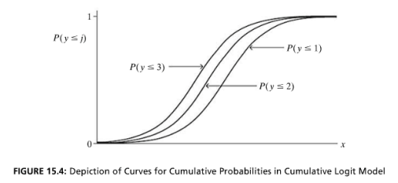

```{r, echo = FALSE, results = "hide"}
include_supplement("vufgb-odds-012-nl-figure01.jpg", recursive = TRUE)
```

Question
========

Given is the figure below belonging to the proportional odds model.

What do we see in this figure?


  
Answerlist
----------
* The relationship between the cumulative probability of *Y* and *X*. This is a log-linear relationship.
* The relationship between *Y* and the cumulative probability of *X*. This is a log-linear relationship.
* The relationship between the cumulative probability of *Y* and *X*. This is a log-linear relationship.
* The relationship between *Y* and the cumulative probability of *X*. This is a log-linear relationship.

Solution
========

Answerlist
----------
* Incorrect
* Incorrect
* Correct
* Incorrect

Meta-information
================
exname: vufgb-odds-012-en
extype: schoice
exsolution: 0010
exsection: Inferential Statistics/Regression/Logistic regression/Odds, Inferential Statistics/Regression/Logistic regression
exextra[ID]: de3f3
exextra[Type]: Interpreting graph, Conceptual
exextra[Program]: 
exextra[Language]: English
exextra[Level]: Statistical Thinking
