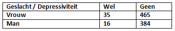

```{r, echo = FALSE, results = "hide"}
include_supplement("vufgb-oddsratio-003-nl-table01.jpg", recursive = TRUE)
```

Question
========
  
(Chronische) depressiviteit komt bij mannen en vrouwen in verschillende mate voor. Bereken op basis van onderstaande kruistabel de odds-ratio voor depressiviteit om deze samenhang weer te geven.



Formule voor de odds ratio:

$\theta = \frac{\frac{\pi_{1}}{(1-\pi_{1})}}{\frac{\pi_{2}}{(1-\pi_{2})}}$


  
Answerlist
----------
* 1.00
* 1.75
* 1.81
* 2.00

Solution
========

Answerlist
----------
* Incorrect
* Incorrect
* Correct
* Incorrect

Meta-information
================
exname: vufgb-oddsratio-003-nl
extype: schoice
exsolution: 0010
exsection: Descriptive statistics/Summary Statistics/Odds ratio, Descriptive statistics/Data representation/Tables
exextra[ID]: 43144
exextra[Type]: Calculation
exextra[Program]: 
exextra[Language]: Dutch
exextra[Level]: Statistical Thinking
