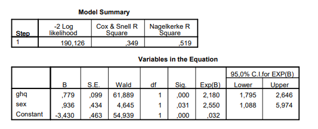
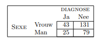

```{r, echo = FALSE, results = "hide"}
include_supplement("vufgb-oddsratio-004-nl-table01.jpg", recursive = TRUE)
```

```{r, echo = FALSE, results = "hide"}
include_supplement("vufgb-oddsratio-004-nl-table02.jpg", recursive = TRUE)
```

Question
========
  
See logistic regression output below. In the analysis, the diagnosis of depression (yes=1) was predicted by a psychiatrist based on the score on the General Health Questionnaire (GHQ) and gender (female=1).


  
From the same data is given the following 2 × 2 table for sex and diagnosis.

  
  
What is the Odds ratio? 
Answerlist
----------
* 17800.28
* 1.04
* 0.01
* 2.55

Solution
========

Answerlist
----------
* Incorrect
* Correct
* Incorrect
* Incorrect

Meta-information
================
exname: vufgb-oddsratio-004-en
extype: schoice
exsolution: 0100
exsection: Inferential Statistics/Regression/Logistic regression/Odds ratio, Descriptive statistics/Data representation/Tables
exextra[Type]: Calculation, Interpreting graph
exextra[Program]: 
exextra[Language]: English
exextra[Level]: Statistical Thinking
