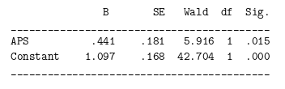

```{r, echo = FALSE, results = "hide"}
include_supplement("vufgb-oddsratio-005-nl-table01.jpg", recursive = TRUE)
```

Question
========

Using the logistic regression below, examine whether people with Borderline Personality Disorder (BPS) are also more likely to have Antisocial Personality Disorder (APS). Using the output below, calculate the odds ratio describing this relationship.



  
Answerlist
----------
* 0.81
* 1.55
* 0.44
* 2.49


Solution
========

Answerlist
----------
* Incorrect
* Correct
* Incorrect
* Incorrect

Meta-information
================
exname: vufgb-oddsratio-005-en
extype: schoice
exsolution: 0100
exsection: Inferential Statistics/Regression/Logistic regression/Odds ratio, Descriptive statistics/Data representation/Tables
exextra[Type]: Calculation
exextra[Program]: 
exextra[Language]: English
exextra[Level]: Statistical Thinking
