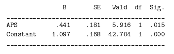

```{r, echo = FALSE, results = "hide"}
include_supplement("vufgb-oddsratio-005-nl-table01.jpg", recursive = TRUE)
```

Question
========

Met behulp van de onderstaande logistische regressie wordt onderzocht of mensen met een Borderline Persoonlijkheidsstoornis (BPS) ook vaker een Antisociale Persoonlijkheidsstoornis (APS) hebben. Bereken met behulp van onderstaande output de odds ratio die dit verband beschrijft.



  
Answerlist
----------
* 0.81
* 1.55
* 0.44
* 2.49


Solution
========

Answerlist
----------
* Incorrect
* Correct
* Incorrect
* Incorrect

Meta-information
================
exname: vufgb-oddsratio-005-nl
extype: schoice
exsolution: 0100
exsection: Inferential Statistics/Regression/Logistic regression/Odds ratio, Descriptive statistics/Data representation/Tables
exextra[Type]: Calculation
exextra[Program]: 
exextra[Language]: Dutch
exextra[Level]: Statistical Thinking