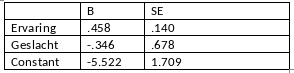

```{r, echo = FALSE, results = "hide"}
include_supplement("vufgb-oddsratio-006-nl-table01.jpg", recursive = TRUE)
```

Question
========

See logistic regression results below. In a survey (n=150), programmers must solve a programming problem in one hour. The resulting data file contains the response variable "solved" (dummy, solved within an hour=1) and the predictors "experience" (programming experience in months) and gender (dummy, male=1).


  
What is the odds ratio for gender? 
Answerlist
----------
* 1.58
* 1.79
* 0.46
* 0.71


Solution
========

Answerlist
----------
* Incorrect
* Incorrect
* Incorrect
* Correct

Meta-information
================
exname: vufgb-oddsratio-006-en
extype: schoice
exsolution: 0001
exsection: Inferential Statistics/Regression/Logistic regression/Odds ratio, Descriptive statistics/Data representation/Tables
exextra[Type]: Interpreting output, Calculation
exextra[Program]: 
exextra[Language]: English
exextra[Level]: Statistical Literacy
