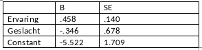

```{r, echo = FALSE, results = "hide"}
include_supplement("vufgb-oddsratio-006-nl-table01.jpg", recursive = TRUE)
```

Question
========

Zie onderstaande logistische regressie-uitkomsten. In een onderzoek (n=150), moeten programmeurs een programmeerprobleem in een uur oplossen. Het resulterende databestand bevat de responsvariabele ‘opgelost’ (dummy, binnen een uur opgelost=1) en de predictoren ‘ervaring’ (programmeerervaring in maanden) en geslacht (dummy, man=1).


  
Hoe groot is de oddsratio voor sekse?
  
Answerlist
----------
* 1.58 
* 1.79 
* 0.46
* 0.71


Solution
========

Answerlist
----------
* Incorrect
* Incorrect
* Incorrect
* Correct

Meta-information
================
exname: vufgb-oddsratio-006-nl
extype: schoice
exsolution: 0001
exsection: Inferential Statistics/Regression/Logistic regression/Odds ratio, Descriptive statistics/Data representation/Tables
exextra[ID]: 81f1f
exextra[Type]: Interpreting output, Calculation
exextra[Program]: 
exextra[Language]: Dutch
exextra[Level]: Statistical Literacy
