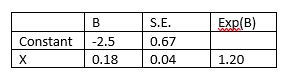

```{r, echo = FALSE, results = "hide"}
include_supplement("vufgb-oddsratio-008-nl-table01.jpg", recursive = TRUE)
```

Question
========

Given below is the output of a single logistic regression analysis performed in a sample of 22 subjects. Calculate the 95% confidence interval of the odds ratio.


  
Answerlist
----------
* 1.107; 1.295
* 1.150; 1.246
* 0.102; 0.258
* 0.022; 0.305


Solution
========

Answerlist
----------
* Correct
* Incorrect
* Incorrect
* Incorrect

Meta-information
================
exname: vufgb-oddsratio-008-en
extype: schoice
exsolution: 1000
exsection: Inferential Statistics/Regression/Logistic regression/Odds ratio
exextra[Type]: Calculation, Interpreting output
exextra[Program]: 
exextra[Language]: English
exextra[Level]: Statistical Literacy
