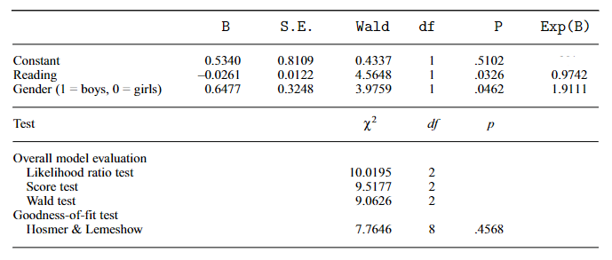

```{r, echo = FALSE, results = "hide"}
include_supplement("vufgb-oddsratio-009-nl-table01.jpg", recursive = TRUE)
```

Question
========

The table below is a logistic regression in which the probability of being referred to a "remedial reading class" is predicted based on a reading ability score ("Reading") and gender.



Complete the following statements.

The 95% confidence interval for Reading's odds ratio contains the value 1 ... .

For an identical reading score, the probability of being referred to remedial reading class for girls is ... than for boys.

  
Answerlist
----------
* Well, smaller
* Yes, larger
* Not, smaller
* Not, larger

Solution
========

Answerlist
----------
* Incorrect
* Incorrect
* Correct
* Incorrect

Meta-information
================
exname: vufgb-oddsratio-009-en
extype: schoice
exsolution: 0010
exsection: Inferential Statistics/Regression/Logistic regression/Odds ratio, Inferential Statistics/Regression/Logistic regression, Inferential Statistics/Confidence Intervals
exextra[Type]: Interpreting output, Conceptual
exextra[Program]: 
exextra[Language]: English
exextra[Level]: Statistical Literacy
