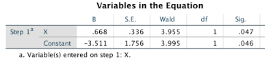

```{r, echo = FALSE, results = "hide"}
include_supplement("vufgb-oddsratio-013-nl-table01.jpg", recursive = TRUE)
```

Question
========

Given are the results of a binary logistic regression analysis below.

Calculate the Odds Ratio (*OR*) representing the relationship between *X* and *Y*.


  
Answerlist
----------
* 2.01
* 1.95
* 1.40
* 0.03

Solution
========

Answerlist
----------
* Incorrect
* Correct
* Incorrect
* Incorrect

Meta-information
================
exname: vufgb-oddsratio-013-en
extype: schoice
exsolution: 0100
exsection: Inferential Statistics/Regression/Logistic regression/Odds ratio, Inferential Statistics/Regression/Logistic regression
exextra[Type]: Calculation, Interpreting output
exextra[Program]: 
exextra[Language]: English
exextra[Level]: Statistical Literacy
