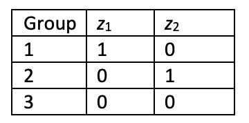

```{r, echo = FALSE, results = "hide"}
include_supplement("vufgb-onewayanova-003-en-graph-01.png", recursive = TRUE)
```
Question
========
  
A oneway ANOVA is conducted to compare three groups on a dependent variable. Study the table below and complete the following sentence. The variable Group is also called ____ and the variables $z_{1}$ and $z_{2}$ are also called ________.

 
  
Answerlist
----------
* Dummy variable ; Factors.
* Factor ; Dummy variables.
* Factor ; Interaction variables.
* Interaction variable ; Factors.

Solution
========

Answerlist
----------
* Incorrect
* Correct
* Incorrect
* Incorrect

Meta-information
================
exname: vufgb-onewayanova-003-en
extype: schoice
exsolution: 0100
exsection: Inferential Statistics/Parametric Techniques/ANOVA/Oneway ANOVA
exextra[ID]: 2a35e
exextra[Type]: Conceptual
exextra[Language]: English
exextra[Level]: Statistical Literacy
