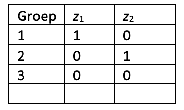

```{r, echo = FALSE, results = "hide"}
include_supplement("vufgb-onewayanova-003-nl-graph-01.png", recursive = TRUE)
```
Question
========
  
Een eenwegs ANOVA wordt gebruikt om drie groepen te vergelijken op een afhankelijke variabele. Bestudeer onderstaande tabel en vul aan. De variabele Groep wordt ook wel een ____ genoemd en de variabelen $z_{1}$ en $z_{2}$ ook wel ________.

 
  
Answerlist
----------
* Dummy variabele ; Factoren.
* Factor ; Dummy variabelen.
* Factor ; Interactievariabelen.
* Interactie variabele ; Factoren.

Solution
========

Answerlist
----------
* Incorrect
* Correct
* Incorrect
* Incorrect

Meta-information
================
exname: vufgb-onewayanova-003-nl
extype: schoice
exsolution: 0100
exsection: Inferential Statistics/Parametric Techniques/ANOVA/Oneway ANOVA
exextra[Type]: Conceptual
exextra[Language]: Dutch
exextra[Level]: Statistical Literacy