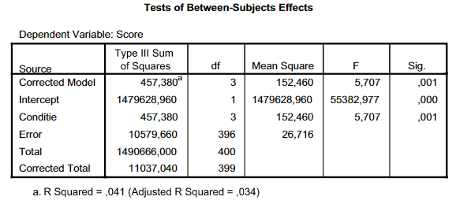
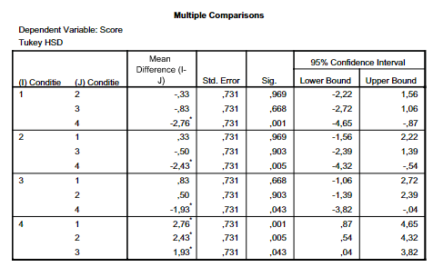

```{r, echo = FALSE, results = "hide"}
include_supplement("vufgb-onewayanova-005-nl-table01.jpg", recursive = TRUE)
```
```{r, echo = FALSE, results = "hide"}
include_supplement("vufgb-onewayanova-005-nl-table02.jpg", recursive = TRUE)
```
Question
========

A researcher conducts an experiment comparing four conditions. For each condition, he draws a random sample. He analyzes the scores with a one-way ANOVA. Below is part of the results.





Which conclusion is correct? 
Answerlist
----------
* The group averages are all significantly different from each other.
* The average of condition 4 is significantly different from the averages of condition 1, 2 and 3, but the averages of condition 1, 2 and 3 are not significantly different from each other.
* The average of condition 4 is not significantly different from the averages of condition 1, 2 and 3, but the averages of condition 1, 2 and 3 are significantly different from each other.
* The group averages are all not significantly different from each other.

Solution
========

Answerlist
----------
* Incorrect
* Correct
* Incorrect
* Incorrect

Meta-information
================
exname: vufgb-onewayanova-005-en
extype: schoice
exsolution: 0100
exsection: Inferential Statistics/Parametric Techniques/ANOVA/Oneway ANOVA, Descriptive statistics/Data representation/Tables
exextra[Type]: Interpreting output
exextra[Program]: 
exextra[Language]: English
exextra[Level]: Statistical Literacy
