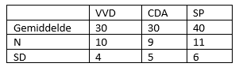

```{r, echo = FALSE, results = "hide"}
include_supplement("vufgb-onewayanova-008-nl-table01.jpg", recursive = TRUE)
```

Question
========

A student investigates whether there are differences in social engagement between politicians of the VVD, CDA and SP. The results are summarized in the table below. What is the size of the Mean Square Within ($MS_{Within}$) of the ANOVA model?


  
Answerlist
----------
* 23.47
* 25.37
* 26.07
* 28.93

Solution
========

Answerlist
----------
* Incorrect
* Incorrect
* Correct
* Incorrect

Meta-information
================
exname: vufgb-onewayanova-008-en
extype: schoice
exsolution: 0010
exsection: Inferential Statistics/Parametric Techniques/ANOVA/Oneway ANOVA
exextra[Type]: Interpreting output, Calculation
exextra[Program]: 
exextra[Language]: English
exextra[Level]: Statistical Literacy
