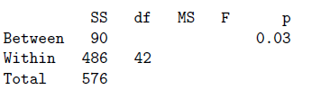

```{r, echo = FALSE, results = "hide"}
include_supplement("vufgb-onewayanova-010-nl-table01.jpg", recursive = TRUE)
```

Question
========

The following data relate to the following two tasks. An A&O psychologist compares the degree of extraversion among Administrative, Managerial and Sales personnel. A total of 45 individuals participate. Below is the incomplete table of data resulting from an Oneway Anova with Personnel as the Factor and extraversion as the dependent variable.



The (marginal) variance of the extraversion variable falls in the interval: 
Answerlist
----------
* [12; 13]
* [13; 14]
* [11; 12]
* [14; 15]

Solution
========

Answerlist
----------
* Incorrect
* Correct
* Incorrect
* Incorrect

Meta-information
================
exname: vufgb-onewayanova-010-en
extype: schoice
exsolution: 0100
exsection: Inferential Statistics/Parametric Techniques/ANOVA/Oneway ANOVA, Inferential Statistics/Parametric Techniques/Variance
exextra[ID]: 5b4b8
exextra[Type]: Interpreting output, Calculation
exextra[Program]: 
exextra[Language]: English
exextra[Level]: Statistical Thinking
