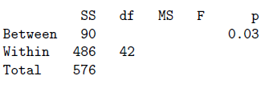

```{r, echo = FALSE, results = "hide"}
include_supplement("vufgb-onewayanova-010-nl-table01.jpg", recursive = TRUE)
```

Question
========

De volgende gegevens hebben betrekking op de volgende twee opgaven. Een A&O-psycholoog vergelijkt de mate van extraversie onder Administratief, Leidinggevend en Verkopend personeel. In het totaal doen 45 personen mee. Hieronder staat de incomplete tabel met gegevens die het resultaat zijn van
een Oneway Anova met Personeel als Factor en extraversie als afhankelijke variabele.



De (marginale) variantie van de extraversie variabele valt in het interval:
  
Answerlist
----------
* [12; 13]
* [13; 14]
* [11; 12]
* [14; 15]

Solution
========

Answerlist
----------
* Incorrect
* Correct
* Incorrect
* Incorrect

Meta-information
================
exname: vufgb-onewayanova-010-nl
extype: schoice
exsolution: 0100
exsection: Inferential Statistics/Parametric Techniques/ANOVA/Oneway ANOVA, Inferential Statistics/Parametric Techniques/Variance
exextra[ID]: 7b070
exextra[Type]: Interpreting output, Calculation
exextra[Program]: 
exextra[Language]: Dutch
exextra[Level]: Statistical Thinking
